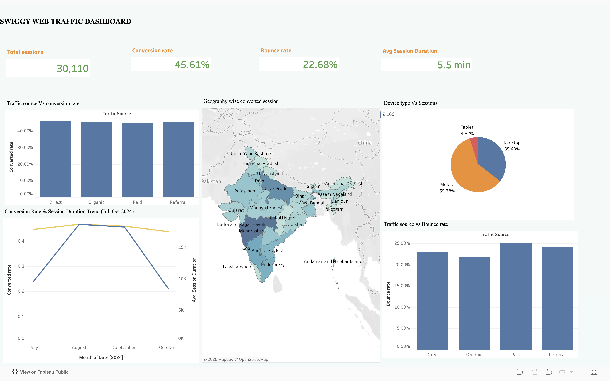
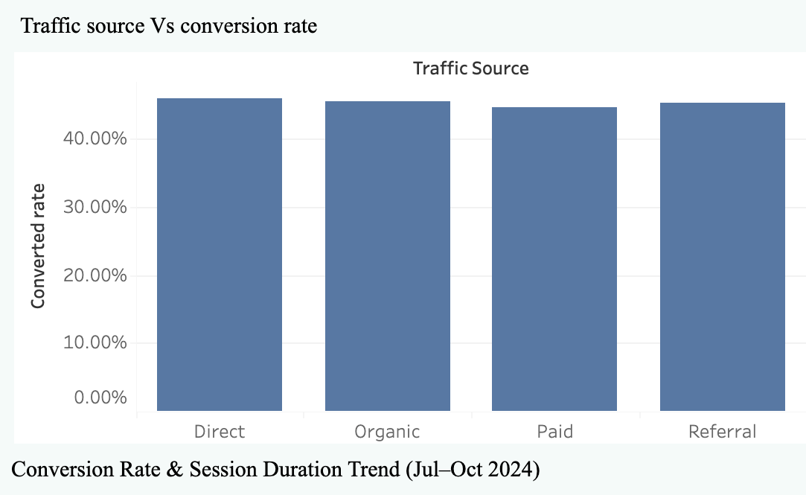
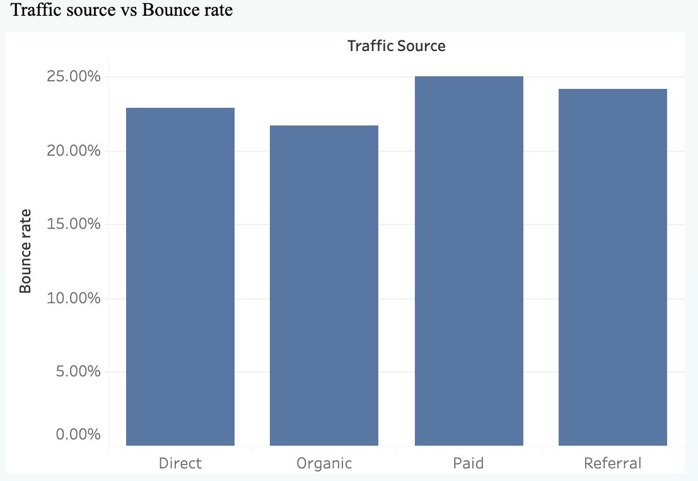
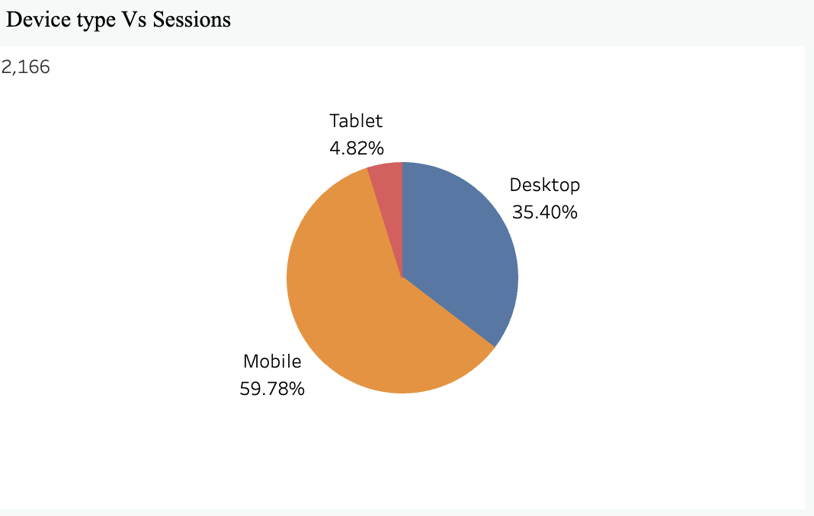
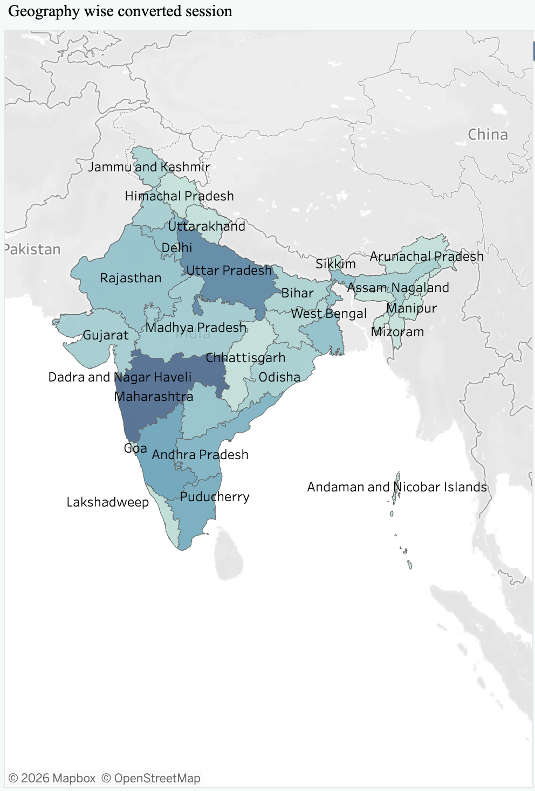
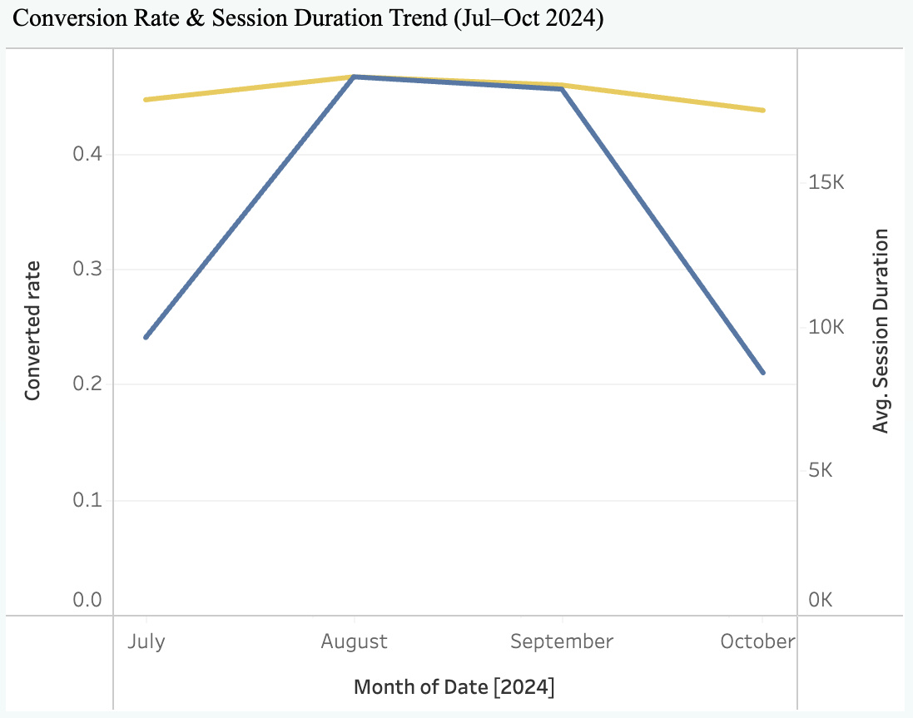

# Swiggy Web Traffic Analysis Dashboard (Tableau)

## Project Overview
This project focuses on analyzing Swiggy’s website traffic and user engagement data using Tableau.  
The dashboard provides insights into user behavior, conversion trends, traffic sources, device performance, and geographic analysis to help improve business decision-making and conversion optimization.

---

## Objectives
- Analyze website traffic patterns
- Identify high-performing traffic sources
- Compare device-wise user engagement
- Track conversion and bounce rates
- Visualize geographic performance
- Provide actionable business insights

---

## Tools & Technologies Used
- Tableau Public
- Microsoft Excel / CSV
- Data Visualization
- Dashboard Design
- KPI Analysis

---

## Key KPIs Tracked
- Total Sessions
- Conversion Rate
- Bounce Rate
- Average Session Duration

---

## Dashboard Features
### 1. KPI Cards
Displays high-level business metrics:
- Total Sessions
- Conversion Rate
- Bounce Rate
- Avg Session Duration

### 2. Traffic Source Analysis
Analyzes conversion and bounce rate across:
- Direct
- Organic
- Paid
- Referral traffic

### 3. Device Analysis
Compares sessions across:
- Mobile
- Desktop
- Tablet

### 4. Geographic Analysis
Visualizes converted sessions across Indian states.

### 5. Trend Analysis
Tracks conversion rate and session duration trends over time.

---

## Business Insights
- Mobile users contribute the highest traffic share.
- Organic and Direct traffic sources drive strong conversions.
- Paid traffic shows relatively higher bounce rates.
- Certain states contribute significantly higher converted sessions.
- User engagement trends vary across months.

---

## Tableau Dashboard Link
[View Live Dashboard](https://public.tableau.com/app/profile/harshita.sharma1388/viz/SwiggyWebTrafficDasboard/Dashboard2)

---

## Project Structure

```bash
swiggy-web-traffic-analysis-tableau/
│
├── dataset/
│   └── swiggy_web_traffic.csv
│
├── dashboard/
│   └── swiggy_dashboard.twbx
│
├── screenshots/
│   ├── dashboard_overview.png
│   ├── traffic_conversion_rate.png
│   ├── traffic_bounce_rate.png
│   ├── device_analysis.png
│   ├── geo_analysis.png
│   └── conversion_trend.png
│
└── README.md
```

---

## Dashboard Screenshots

### Dashboard Overview


---

### Traffic Conversion Rate


---

### Traffic Bounce Rate


---

### Device Analysis


---

### Geographic Analysis


---

### Conversion Trend


---

## Conclusion
This dashboard helps understand user engagement, traffic performance, and conversion behavior, enabling data-driven marketing decisions and optimization opportunities for Swiggy’s digital platform.
